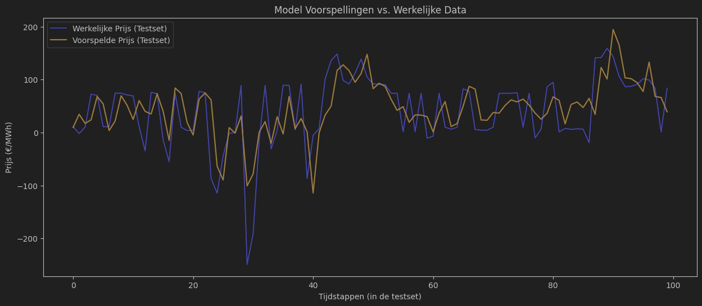
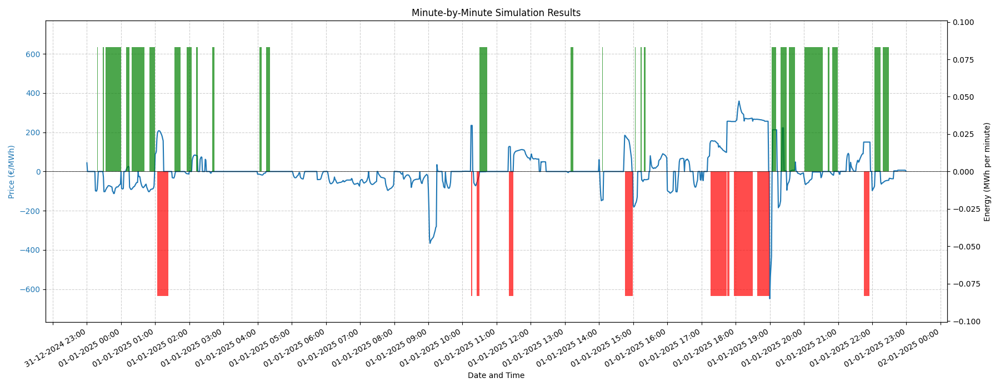

# Run the Project

1.  **Set up the Environment:**
    First, create and activate a virtual environment.
    ```bash
    python3 -m venv .venv
    source .venv/bin/activate
    ```

2.  **Install Dependencies:**
    Install all the required packages using the `requirements.txt` file.
    ```bash
    pip install -r requirements.txt
    ```

3.  **Run the Simulation:**
    Navigate to the `Simulation` directory and execute the driver script as a module. You can choose a mode to run.
    New plots are saved to the `plots` directory.

    *   **Run a single simulation** with default parameters:
        ```bash
        python -m Simulation.suite_simple_trading.driver --mode run
        ```

    *   **Run a grid search** to find the best heuristic parameters:
        Here you can change the range in the code in `driver.py`.
        ```bash
        python -m Simulation.suite_simple_trading.driver --mode gridsearch
        ```
#### Command-Line Arguments
You can customize the simulation using the following arguments:

*   `--mode`: (Required) Specifies the operating mode.
    *   `run`: Executes a single simulation run.
    *   `gridsearch`: Performs a full grid search to find optimal `buy` and `sell` thresholds.

*   `--buy`: (Optional, for `run` mode) Sets the buying/charging price threshold. Defaults to `10.0`.
    *   Example: `--buy 0`

*   `--sell`: (Optional, for `run` mode) Sets the selling/discharging price threshold. Defaults to `120.0`.
    *   Example: `--sell 150`

*   `--start-date`: (Optional, for `run` mode) Sets the start timestamp for the plot window.
    *   Format: `"YYYY-MM-DD HH:MM:SS"` Also possible without the time part, e.g. `"2025-01-15"`
    *   Default: `"2025-01-01 00:00:00"`
    *   Example: `--start-date "2025-01-15 08:00:00"`

*   `--end-date`: (Optional, for `run` mode) Sets the end timestamp for the plot window.
    *   Format: `"YYYY-MM-DD HH:MM:SS"` Also possible without the time part, e.g. `"2025-01-15"`
    *   Default: 1 day after the start date
    *   Example: `--end-date "2025-01-15 17:00:00"`

**Example with Custom Parameters:**
To run a single simulation and plot only the morning of January 15th:
```bash
python -m Simulation.suite_simple_trading.driver --mode run --buy 0 --sell 150 --start-date "2025-01-15 06:00:00" --end-date "2025-01-15 12:00:00"
```

# Overzicht vooruitgang

## 26/09
Lezen boek Sequential Decision Analytics and modeling - Warren B. Powell.  
Boek legt een conventie uit om een model op te bouwen voor een sequentieel beslissingsprobleem. 

## 27/09
### Price forecasting   
Hello world example in [deze commit](https://github.com/DeLany123/Thesis/commit/340c0341b57fafdc6a76f11dc324c3bce96f8e41)  
Ik las in het boek dat er ook forecasts gebruikt worden in de modellen, om wat af te wisselen ben ik de haalbaarheid ook een beetje aan het onderzoeken.  
    
    
**RMSE: 90.77 €/MWh**

Op de grafiek vallen twee belangrijke kenmerken van het model op:

*   **Vertraagde Voorspelling (Lag):** De voorspelde lijn volgt de werkelijke prijs met een kleine vertraging. Het model heeft geleerd dat de vorige prijs de beste gok is voor de volgende.

*   **Afgevlakte Pieken (Smoothing):** De voorspelling is veel vlakker en mist de extreme pieken en dalen. Het model is getraind om grote fouten te vermijden; een wilde gok op een piek is riskant. Daarom kiest het model voor een veiligere, meer gemiddelde voorspelling om de totale fout zo laag mogelijk te houden.  

### Model
**Doel:**  
*Begrijpen waarom en hoe een model omgaat met onzekerheden en waarom dit niet kan vervangen worden door de forecaster.*

De forecaster geeft één "beste" gok voor de toekomst. Het model uit het boek gebruikt een kansverdeling om meerdere mogelijke toekomstscenario's te simuleren. Hierdoor kan een agent leren om een beslissing te nemen die gemiddeld genomen het beste presteert over al die mogelijke uitkomsten, in plaats van te optimaliseren voor maar één voorspelde toekomst.

## 2/10
### Model
Afwerken van eerste iteratie model alsook het neerschrijven ervan in een LaTeX document. Zie model.pdf .

**Code implementatie**
Eerste simulatie op heuristiek policy in Simulation/first.py

## 6/10
### Simulatie
Eerste simulatie op heuristiek policy "buy low, sell high" in Simulation/first.py [deze commit](https://github.com/DeLany123/Thesis/commit/d86b5aeaedef0a6e1726759b267f536b76d8d68f)
Deze simulatie neemt als input de grote en charge rate van een batterij, alsook een range van mogelijke parameterwaarden 
voor de heuristiek.

De simulatie gebruikt de volgende input (nu met testdata ingevuld):
- **Batterij Capaciteit:** 10.0 MWh
- **Laad-/Ontlaadvermogen:** 2.0 MW
- **Koopdrempels (testbereik):** Van 80 tot 100 EUR/MWh
- **Verkoopdrempels (testbereik):** Van 105 tot 125 EUR/MWh

Met als resultaat
```bash
--- Grid Search Complete ---
Optimal Buy Threshold: 90.00 EUR/MWh
Optimal Sell Threshold: 105.00 EUR/MWh
Resulting Best Profit: 300812.77 EUR
```

Achter de simulatie kwam het besef dat ik nu enkel een "trader" die enkel met een Battery Energy Storage System (BES) kijkt
naar de grootste winst. Er wordt nog **geen rekening gehouden met de demand van de gebruiker.**

De demand van de gebruiker moet vervuld worden door ofwel de batterij te gebruiken, ofwel op de imbalance markt te kopen.
Het kan zelfs zijn dat deze laatste voordeliger lijkt dan de batterij te gebruiken aangezien op een later tijdstip de
elektriciteit kan verkocht worden aan een veel hogere prijs.

Met deze nieuwe inzichten kon ik het model terug wat aanpassen.

### Model
Meer decision variables alsook meer constraints toegevoegd aan het model. Zie model.pdf .
De rest moet nog gewijzigd worden aan het model. Zie nieuw document Thesis_Model_1.pdf .

## 10/10
### Simulatie
Infrastruur verder uitgewerkt zodat meerdere soorten policies en netwerken op hetzelfde model getest kunnen worden.  
Hierbij ook de eerste simulatie afgewerkt en een plotting functie toegevoegd waarbij als parameter de startdatum en lengte
meegegeven kan worden. Zie Simulation/suite_simple_trading/plotting.py [deze commit](https://github.com/DeLany123/Thesis/commit/2a5a2326e22d02cdcd2c4da1de3d3cae7d09cae4)
    
In de plot zien we de beslissing van de batterij om op te laden en de prijs van de imbalanceprijs.

### Eerste meeting Thesis
Overleg over het basic model en alle mogelijke policy families. Alsook de reward functie is besproken.
Besproken om te onderzoeken.
<ol>
<li>Betere reward functie, reward is pas aan het einde van het kwartier.</li>
<li>Policyfamilies bekijken, uittesten, welke zien er veelbelovend uit, welke niet.</li>
<li>Invloed van forecasting op het model</li>
</ol>

