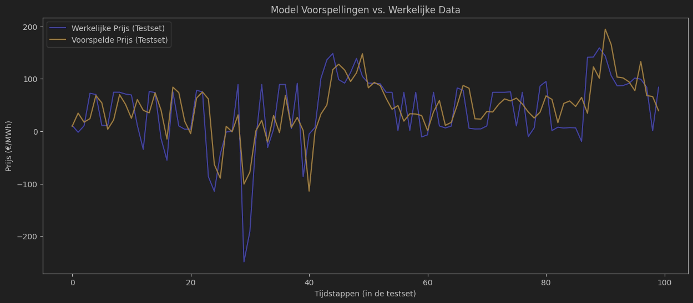
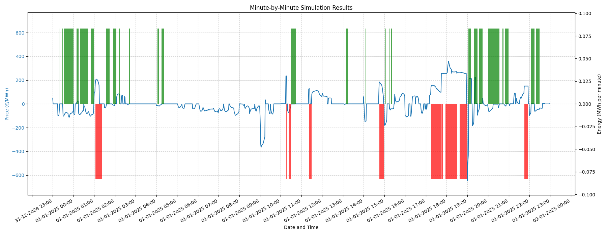
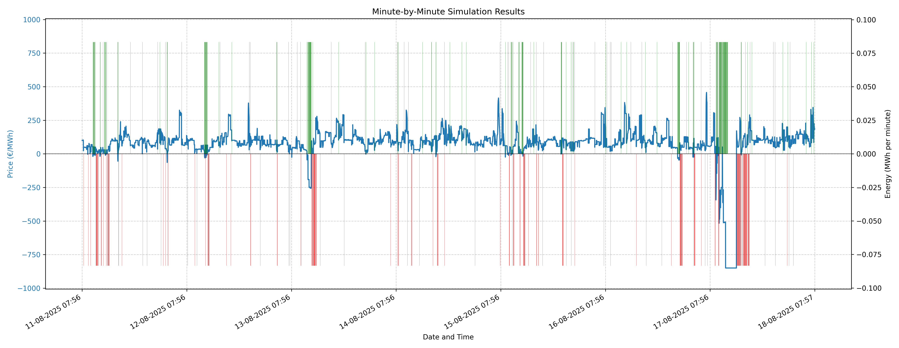
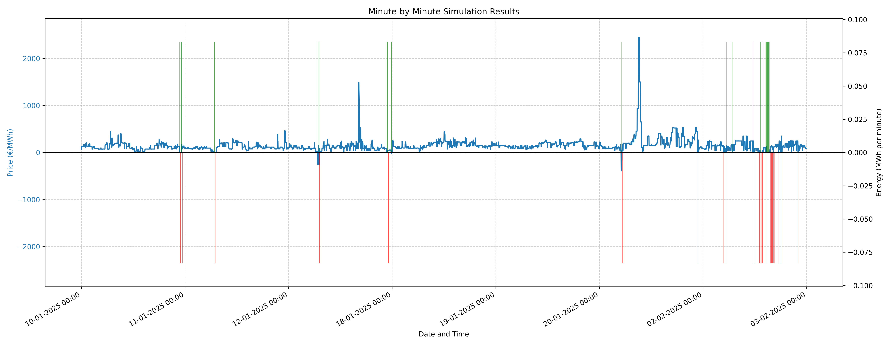
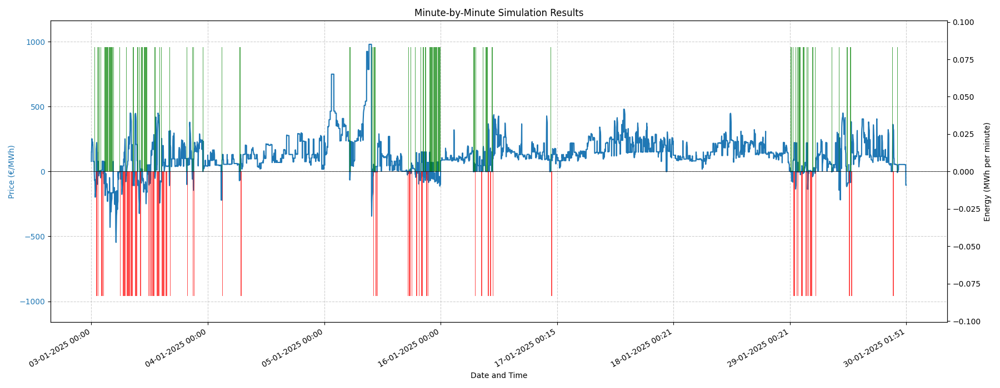
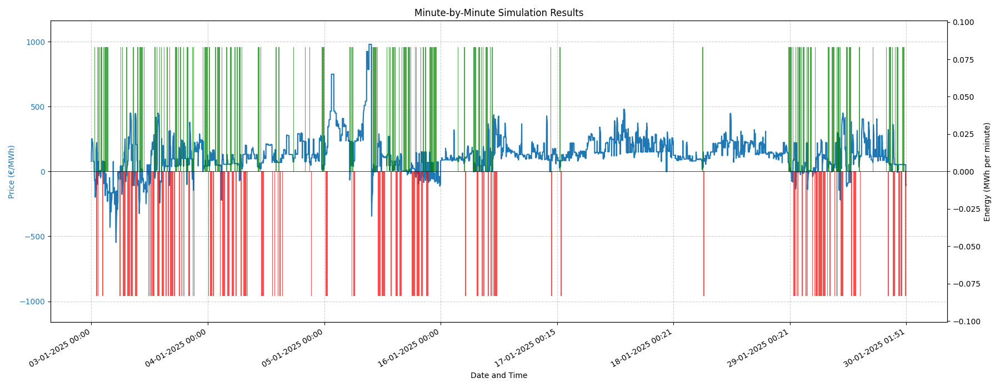
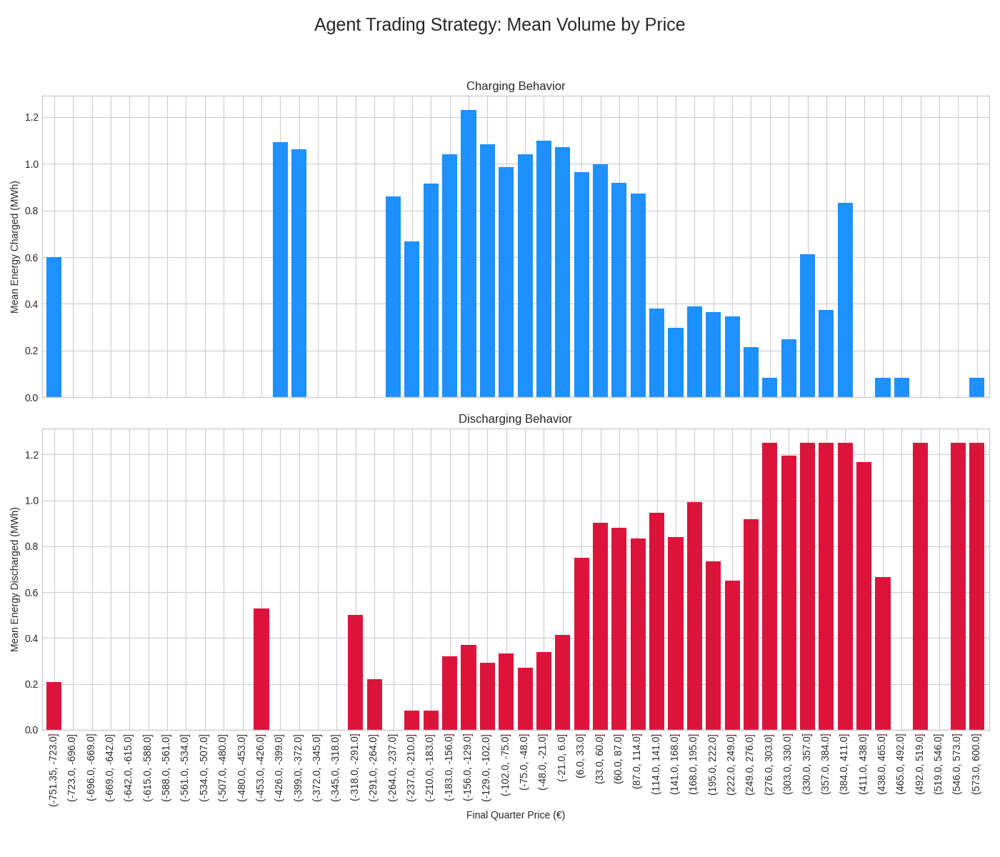
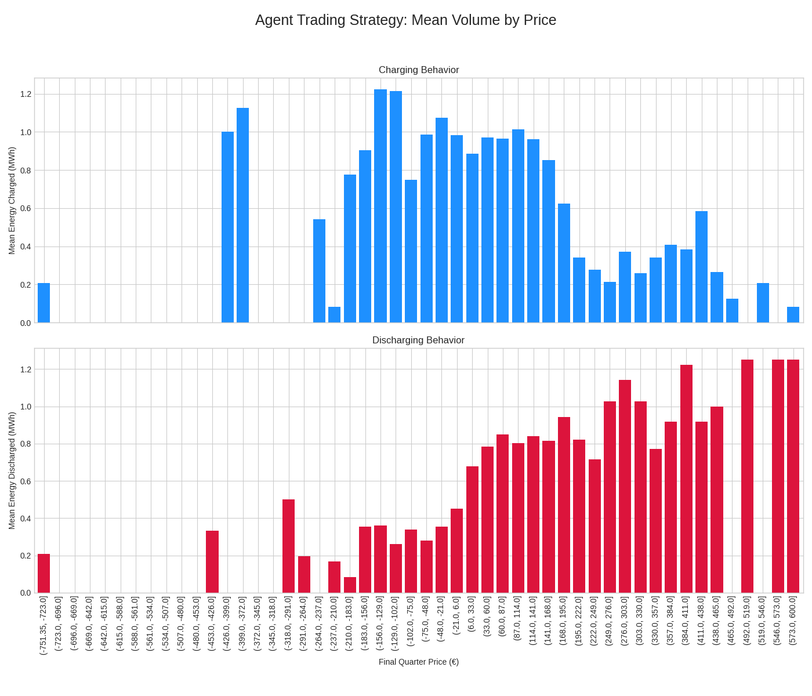
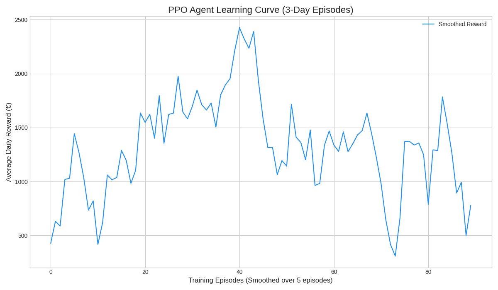
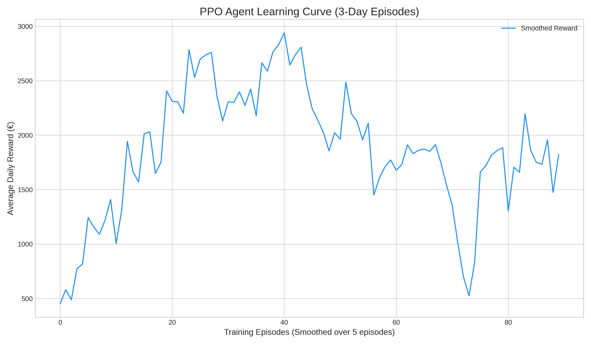

# Codebase
The relevant code files are under the `Simulation/suite_simple_trading/` directory.  
The starting point is the `driver.py` script, which handles command-line arguments and orchestrates the training, evaluation, and tuning of models.

# Run the Project

1.  **Set up the Environment:**
    First, create and activate a virtual environment.
    ```bash
    python3 -m venv .venv
    source .venv/bin/activate
    ```

2.  **Install Dependencies:**
    Install all the required packages using the `requirements.txt` file.
    ```bash
    pip install -r requirements.txt
    ```

3.  **Train, Evaluate, and Tune Models:**
    Navigate to the project's root directory (`ThesisGit`) and execute the driver script as a module. You must specify a command (`rl` or `heuristic`) followed by its arguments. New plots are saved to the `plots` directory.

    *   **Train the RL Agent:**
        ```bash
        python -m Simulation.suite_simple_trading.driver rl --mode train
        ```

    *   **Evaluate the trained RL Agent:**
        ```bash
        python -m Simulation.suite_simple_trading.driver rl --mode run
        ```
    
    *   **Evaluate the Heuristic Policy:**
        ```bash
        python -m Simulation.suite_simple_trading.driver heuristic --mode run
        ```

    *   **Run a Grid Search** for the heuristic policy:
        ```bash
        python -m Simulation.suite_simple_trading.driver heuristic --mode gridsearch
        ```
    
    *   **Run Cross-Validation** for the RL agent:
        ```bash
        python -m Simulation.suite_simple_trading.driver rl --mode test
        ```

### Command-Line Arguments

The script uses two main commands: `rl` and `heuristic`. Each has its own set of options.

#### `rl` Command
Used for training, evaluating, and testing the Reinforcement Learning agent.

*   `--mode`: (Optional) Specifies the operating mode for the RL agent. Defaults to `run`.
    *   `train`: Trains the DQN agent on the training dataset and saves the model.
    *   `run`: Evaluates the pre-trained DQN agent on the test dataset.
    *   `test`: Performs a full time-series cross-validation.
*   `--start-date`: (Optional, for `run` mode) Sets the start of the plot window. Format: `"YYYY-MM-DD"`.
*   `--end-date`: (Optional, for `run` mode) Sets the end of the plot window. Format: `"YYYY-MM-DD"`.

#### `heuristic` Command
Used for evaluating and tuning the rule-based heuristic policy.

*   `--mode`: (Optional) Specifies the operating mode for the heuristic. Defaults to `run`.
    *   `run`: Executes a single simulation run on the test dataset.
    *   `gridsearch`: Performs a full grid search to find optimal `buy` and `sell` thresholds.
*   `--buy`: (Optional, for `run` mode) Sets the buying/charging price threshold. Defaults to `10.0`.
*   `--sell`: (Optional, for `run` mode) Sets the selling/discharging price threshold. Defaults to `120.0`.
*   `--start-date`: (Optional, for `run` mode) Sets the start of the plot window. Format: `"YYYY-MM-DD"`.
*   `--end-date`: (Optional, for `run` mode) Sets the end of the plot window. Format: `"YYYY-MM-DD"`.

### Examples

*   **Run the RL agent and plot the first week of the test period:**
    ```bash
    python -m Simulation.suite_simple_trading.driver rl --mode run --start-date "2025-01-01" --end-date "2025-01-08"
    ```

*   **Run the heuristic with custom thresholds:**
    ```bash
    python -m Simulation.suite_simple_trading.driver heuristic --mode run --buy 0 --sell 150
    ```
    

# Overzicht vooruitgang

## 26/09
Lezen boek Sequential Decision Analytics and modeling - Warren B. Powell.  
Boek legt een conventie uit om een model op te bouwen voor een sequentieel beslissingsprobleem. 

## 27/09
### Price forecasting   
Hello world example in [deze commit](https://github.com/DeLany123/Thesis/commit/340c0341b57fafdc6a76f11dc324c3bce96f8e41)  
Ik las in het boek dat er ook forecasts gebruikt worden in de modellen, om wat af te wisselen ben ik de haalbaarheid ook een beetje aan het onderzoeken.  
    
    
**RMSE: 90.77 €/MWh**

Op de grafiek vallen twee belangrijke kenmerken van het model op:

*   **Vertraagde Voorspelling (Lag):** De voorspelde lijn volgt de werkelijke prijs met een kleine vertraging. Het model heeft geleerd dat de vorige prijs de beste gok is voor de volgende.

*   **Afgevlakte Pieken (Smoothing):** De voorspelling is veel vlakker en mist de extreme pieken en dalen. Het model is getraind om grote fouten te vermijden; een wilde gok op een piek is riskant. Daarom kiest het model voor een veiligere, meer gemiddelde voorspelling om de totale fout zo laag mogelijk te houden.  

### Model
**Doel:**  
*Begrijpen waarom en hoe een model omgaat met onzekerheden en waarom dit niet kan vervangen worden door de forecaster.*

De forecaster geeft één "beste" gok voor de toekomst. Het model uit het boek gebruikt een kansverdeling om meerdere mogelijke toekomstscenario's te simuleren. Hierdoor kan een agent leren om een beslissing te nemen die gemiddeld genomen het beste presteert over al die mogelijke uitkomsten, in plaats van te optimaliseren voor maar één voorspelde toekomst.

## 2/10
### Model
Afwerken van eerste iteratie model alsook het neerschrijven ervan in een LaTeX document. Zie model.pdf .

**Code implementatie**
Eerste simulatie op heuristiek policy in Simulation/first.py

## 6/10
### Simulatie
Eerste simulatie op heuristiek policy "buy low, sell high" in Simulation/first.py [deze commit](https://github.com/DeLany123/Thesis/commit/d86b5aeaedef0a6e1726759b267f536b76d8d68f)
Deze simulatie neemt als input de grote en charge rate van een batterij, alsook een range van mogelijke parameterwaarden 
voor de heuristiek.

De simulatie gebruikt de volgende input (nu met testdata ingevuld):
- **Batterij Capaciteit:** 10.0 MWh
- **Laad-/Ontlaadvermogen:** 2.0 MW
- **Koopdrempels (testbereik):** Van 80 tot 100 EUR/MWh
- **Verkoopdrempels (testbereik):** Van 105 tot 125 EUR/MWh

Met als resultaat
```bash
--- Grid Search Complete ---
Optimal Buy Threshold: 90.00 EUR/MWh
Optimal Sell Threshold: 105.00 EUR/MWh
Resulting Best Profit: 300812.77 EUR
```

Achter de simulatie kwam het besef dat ik nu enkel een "trader" die enkel met een Battery Energy Storage System (BES) kijkt
naar de grootste winst. Er wordt nog **geen rekening gehouden met de demand van de gebruiker.**

De demand van de gebruiker moet vervuld worden door ofwel de batterij te gebruiken, ofwel op de imbalance markt te kopen.
Het kan zelfs zijn dat deze laatste voordeliger lijkt dan de batterij te gebruiken aangezien op een later tijdstip de
elektriciteit kan verkocht worden aan een veel hogere prijs.

Met deze nieuwe inzichten kon ik het model terug wat aanpassen.

### Model
Meer decision variables alsook meer constraints toegevoegd aan het model. Zie model.pdf .
De rest moet nog gewijzigd worden aan het model. Zie nieuw document Thesis_Model_1.pdf .

## 10/10
### Simulatie
Infrastruur verder uitgewerkt zodat meerdere soorten policies en netwerken op hetzelfde model getest kunnen worden.  
Hierbij ook de eerste simulatie afgewerkt en een plotting functie toegevoegd waarbij als parameter de startdatum en lengte
meegegeven kan worden. Zie Simulation/suite_simple_trading/plotting.py [deze commit](https://github.com/DeLany123/Thesis/commit/2a5a2326e22d02cdcd2c4da1de3d3cae7d09cae4)
    
In de plot zien we de beslissing van de batterij om op te laden en de prijs van de imbalanceprijs.

### Eerste meeting Thesis
Overleg over het basic model en alle mogelijke policy families. Alsook de reward functie is besproken.
Besproken om te onderzoeken.
<ol>
<li>Betere reward functie, reward is pas aan het einde van het kwartier.</li>
<li>Policyfamilies bekijken, uittesten, welke zien er veelbelovend uit, welke niet.</li>
<li>Invloed van forecasting op het model</li>
</ol>

## 17/10
### Model
DQN agent opgezet in Simulation/suite_simple_trading/agents/dqn_agent.py.
State space uitgebreid met meerdere relative oplaad levels.

### Resulaten

We zien dat het model enkel wilt kopen als het een negatief prijs heeft gezien in de state. Hierna probeert het heel 
snel terug te verkopen voor een positieve prijs. En houdt waarschijnlijk nog geen rekening met een hoge prijs in de toekomst.

## 28/10
Lang gewerkt aan revampen van het model. Meer in de literatuur gedoken om bij te lezen over de verschillende oplosmethodes.
Geleerd hoe DQN werkt.

### Overleg
Overleg gehad met Professor Claeys en Naim over aanpak van het verbeteren van de resultaten.
Conclusie was het niet uitbereiden van het model, dit zou de resultaten nog oninterpreteerbaarder maken.
De volgende stap is om Decision masking te implementeren. Nu worden sommige acties geblockt omdat bijvoorbeeld de batterij vol is.
Het netwerk leert wel nog dat deze beslissing de beste is, en slaat deze op in de lookup table (zie DQN). We moeten er nu voor
zorgen dat deze acties niet meer gekozen kunnen worden in het netwerk zelf. 
In de volgende repo zouden er modellen moeten zijn die decision masking ondersteunen.  
https://sb3-contrib.readthedocs.io/en/master/  

Daarnaast kan er ook gekeken worden of er niet aan aggregatie kan gedaan worden van actions. Dat bijvoorbeeld elke 5 minuten
een actie genomen wordt voor de volgende 5. Hiermee kunnen we effecten van de delayed reward wat verminderen.


## 1/11
### PPO Agent
PPO agent opgezet. Programma heeft nu extra command line argumenten om te kiezen tussen DQN en PPO.
Resultaten van PPO waren direct beter als dat van DQN.

Er is een duidelijkere policy keuze zichtbaar. De agent koopt bij negatieve prijzen en verkoopt bij positieve prijzen.
Iets wat nog niet te zien was bij de DQN agent.

### Runtime
Na het uitproberen van verschillende ordes van total_timesteps ( dit is het aantal stappen dat de agent leert ) werd het
al snel duidelijk dat de resultaten niet veel slechter werden bij een veel kleinere aantal stappen.  

10_000 stappen geeft met dit model hetzelfde restulaat als 1_000_000 stappen. Dit is een groot verschil in runtime.


## 10/11

### Train/Test Split and Episodic Training

The data splitting methodology has been fundamentally reworked for more robust and reliable model evaluation.

#### Problem: Weakness of Chronological Split
The previous method used a simple 80/20 chronological split. This was flawed because the model was only tested on a specific, non-representative time period (e.g., the last months of the year). This made model comparisons unreliable and risked overfitting to the test period's specific market conditions.

#### New Approach: Randomized Episodic Split
1.  **Episodic Structure:** The dataset is now divided into "episodes," where each episode consists of a configurable number of consecutive days.
2.  **Random Selection:** A fraction of these episodes are randomly selected from the *entire dataset* to form the test set. All other data is used for training.
3.  **Buffer Zone:** To prevent data leakage, a buffer of several days is excluded around each test episode. This data is not used for training or testing.

**Note:** To generate a new random split, the previously saved `train_data.pkl` and `test_data.pkl` files must be deleted.

#### New Hyperparameters

*   `DAYS_PER_EPISODE`: The number of consecutive days in one episode. This defines the agent's time horizon. A longer episode allows the agent to learn more complex, multi-day strategies (e.g., charge on weekends, sell on weekdays).

*   `TEST_FRACTION`: The fraction of total days to allocate to the test set. A value of `0.2` creates a representative 20% test sample from the entire dataset.

*   `BUFFER_DAYS`: The number of days excluded before and after each test episode. This ensures a clean separation between train and test data, preventing the agent from using knowledge of the period immediately preceding a test episode.

#### Expected Benefits
This new split leads to a more reliable evaluation. The agent is now tested on diverse periods throughout the year, forcing it to learn a more general and robust policy.

### Further Research
*   Impact of shorter vs. longer episodes.
*   Impact of larger vs. smaller buffer sizes.
*   Utility of training for more `total_timesteps`.

### Analysis of `total_timesteps`
Increasing `total_timesteps` currently shows little benefit. The agent quickly converges to a simple, local-optimum strategy: it buys at negative prices and sells immediately after for a small profit.

### Needed Improvement
The agent must learn to perform true price arbitrage (buy positive, sell higher). Currently, it avoids risk and only exploits the obvious negative price opportunities.


## 12/11

### Scaling
Created an observation wrapper for scaling in `observation_wrappers.py`

**Problem:**
Input features had unequal scales. The `Imbalance Price` (large range) dominated other features like `SoC` (small range). This disrupts the training of the neural network.

**Solution:**
- **Price-feature:** Scaled with Robust Scaling (median and IQR). This method is insensitive to extreme outliers.
- **Other features (SoC, volume):** Scaled with Min-Max Scaling, because their bounds are fixed.

**Goal:**
More stable and efficient training of the agent.

### Extra metrics

#### Learning curve
When training output the average reward per day per episode. 

#### Decision graph
Outputs The decisions taken at a certain price. Before we only looked at the total reward. But this is not a metric that
tells the full story, for example the period could been a lucky one, but a lot of bad choices could have been made.

### Scaling Results with the New Metrics

To clearly illustrate the impact of feature scaling, the following sections compare the key performance metrics side-by-side. Each section focuses on a specific type of analysis, showing the result *without scaling* directly above the result *with scaling*.

#### Trading Decisions Over Time

This plot shows the agent's actions (charge/discharge/idle) over a sample period. It gives a direct visual sense of how active the agent is.

**Without Scaling**
In the graph below, we can see the decisions made per step. It is easy to see that the agent still takes minimal risk and does not leverage the battery on only positive prices. It also tries to sell the energy rather quickly and does not wait for a better price.


**With Scaling**
In comparison with the graph above for the same period, we can see that the agent decided to take a lot more actions.
This can indicate that the agent is learning a more sophisticated policy. This is intuitive because now it likely pays more attention to the other features. The `price` feature probably had too great of an impact on the previous agent because it is some magnitudes bigger than the other features.


---

#### Trading Decisions by Price

This plot shows the distribution of prices at which the agent chooses to charge or discharge.  

**Without Scaling**
The plot below tells us more about the prices at which the agent tries to buy. The observed behavior from the previous 
analysis is also seen here. The charging is happening mostly on a positive price, although discharging does a more clear job of selling at higher prices. This might indicate that the agent is making mistakes and not taking into account that the price can change by the end of the quarter.


**With Scaling**
This is the graph with the least visible change. The tail of the charging graph is smoother and longer in the direction of
the positive prices. This might indicate that the agent is trying to leverage more now.  


---

#### Learning Curve (Reward per Episode)

Finally, I have plotted my interpretation of a learning curve, although I am not certain if the methodology is correct. The rewards from each episode were collected during training via a callback, and a moving average of these rewards was then plotted.

The resulting curve is very bumpy, which could suggest several areas for further investigation:
* The model architecture may not be powerful enough. 
* The training duration might be insufficient. 
* The hyperparameters may not be properly fine-tuned.
  
Alternatively, the curve's volatility could be a direct result of the environment's stochastic nature, which would make a bumpy plot an expected outcome. Lastly, it is also possible that my method for generating the learning curve is not standard, and further research on this is required.  
**Without Scaling**  


**With Scaling** It does not look like a big improvement on the first sight, but you can actually see that the curve is much
more smoothened out, has a better mean, and stays higher. The variance of the episodic rewards is smaller, resulting in 
a smoother curve with less severe fluctuations. This indicates that the agent's performance is more consistent and the policy 
is more robust. There is one really bad episode where the reward is very low, but even there, the valley is higher than in the no scaling one.


---
**Reward**  
For a battery of 10kwh (a big at home battery) over a 2 months period, using the agent and having access to use the imbalance price:  
**Without Scaling**  
Would give a **90€ profit**.  
**With Scaling**   
128€ profit. Which is actually not bad (: